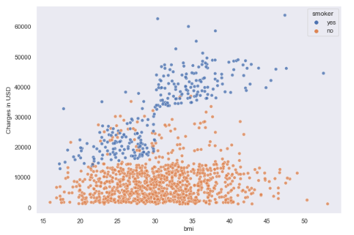

<h1 align=center style="color:#000080;">The Secret to Reducing Health Care Costs: Predicting Health Insurance Claims with Artificial Intelligence</h1>
<h3 align=center style="color:#b30000;"> By Buhari Shehu</h3>

## Introduction
Insurance companies collect premiums from policyholders to cover the cost of claims and make profits. The companies may need more money to cover all of the claims that are filed if they fail to predict the cost of claims accurately. This can lead to financial losses for the insurance company, and it can also lead to policyholders being underinsured. Insurance claim analysis and prediction can also help insurance companies segment policyholders based on risk level, customise marketing strategies, enhance customer satisfaction and prevent fraud.

In this project we explored the insurance claim dataset from Kaggle and find out what influences the cost of claims made by policyholders. We will also use regression models to forecast future claims by the policyholders. The results of this project can help the insurance company to adjust the premiums and reduce expenses. The results can also inform the government about some of the main causes of health problems.

### Data Description
The dataset is publicly available on [Kaggle](https://www.kaggle.com/datasets/mirichoi0218/insurance).

### Dependencies
To run this project successfully, one needs to install and import the following dependencies:
- [NumPy](https://numpy.org)
- [Pandas](https://pandas.pydata.org)
- [Scikit-learn](https://scikit-learn.org/stable/)
- [Seaborn](https://seaborn.pydata.org)
- [Matplotlib](https://matplotlib.org)
- xgboost

## Data Wrangling 
During the data wrangling process, thorough checks were conducted on the dataset to identify and address various data quality issues. This included examining the dataset for missing values, duplicate entries, outliers, errors, and inconsistencies. By performing these meticulous checks, we aimed to enhance the reliability and integrity of the dataset, ensuring its suitability for accurate and insightful analysis.

## Exploratory Data Analysis
We thoroughly explored the dataset, uncovering patterns and insights that served as a guide for formulating meaningful questions and conducting in-depth analyses. We also engineered new features and approach the dataset from multiple perspectives: univariate and multivariate. The chart below shows that Smokers have higher medical costs compared to non-smokers, despite being a minority among policyholders. It also indicate that charges increases with body mass index. Thus, insurance providers can encourage policyholders to abstain from smoking through incentives. They can also encourage weight loss programs to maintain healthy body weights.

*Charges by bmi and smiking status*

## Model Selection and Evalaution
The R-sqaured metric of the model is 0.8378. This signifies that around 83.78% of the variability in the charges can be explianed by the features integrated within the regression model.

## Conclusions and recommendations
1. Given the diverse BMI distributions, consider designing insurance plans that account for the health risks associated with various BMI categories. Tailoring coverage and incentives based on BMI-related health considerations could provide added value to policyholders.

2. Since the highest charge observed is substantial, it's essential to ensure that insurance plans adequately cover such significant costs. Offering flexible coverage options and comprehensive policies can provide peace of mind to policyholders in case of unforeseen medical expenses.

3. Address the higher medical costs associated with smoking by offering specialized plans or benefits tailored to smokers, such as coverage for cessation programs and preventive measures. Promote the long-term health and financial benefits of quitting smoking to policyholders. This can also lead to improved overall health.

4. Tailor marketing and communication strategies to address the needs and concerns of both teenagers and the middle-aged population. Highlight benefits that cater to the specific age groups, such as coverage for young adults' routine check-ups and health screenings or comprehensive plans for those approaching retirement.

5. Encourage policyholders, especially the obese, to adopt healthier lifestyles by offering wellness programs, discounts on gym memberships, and incentives for maintaining a healthy weight. This approach can contribute to overall well-being and potentially lower healthcare costs. 

## License 
The project is licensed under the MIT License.
